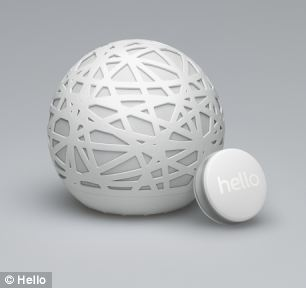
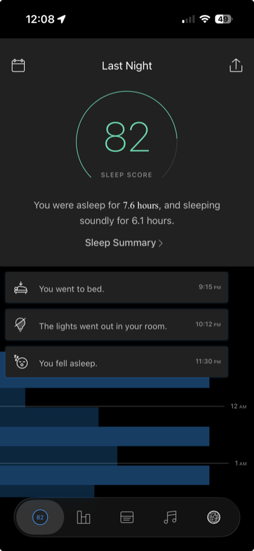
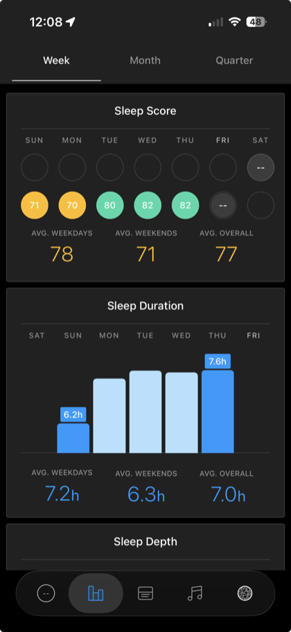
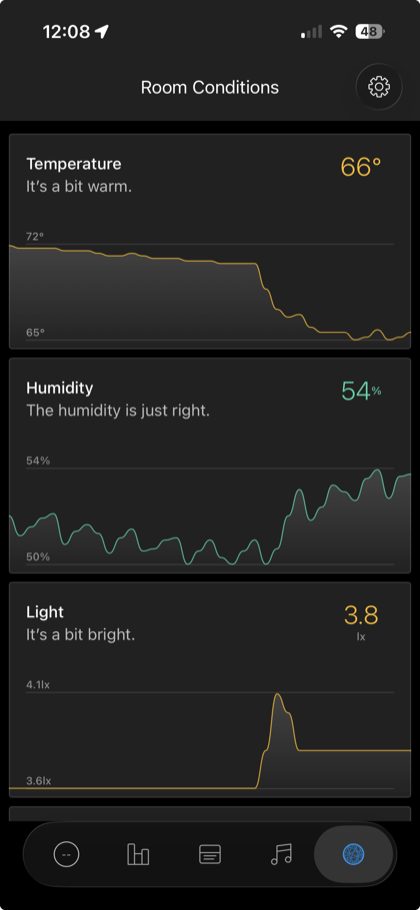

# Reviving the Hello Sense Sleep System



Hello shut down in 2017 and took its cloud with it, which turned every Sense
into an ornament. This brings the whole system back on hardware you own: the
Sense hub, the Sleep Pill, a replacement backend, and the iOS app.

You can view an article with the discovery process here: [https://www.josephspurrier.com/ai-revives-a-dead-sleep-company](https://www.josephspurrier.com/ai-revives-a-dead-sleep-company).

The **Sense** is the perforated sphere: a TI CC3200 that measures temperature,
humidity, light, sound and air quality, and wakes you with an alarm. The
**Sleep Pill** is the disc beside it, a Nordic nRF51422 accelerometer that
clips to your pillow and reports motion to the Sense over ANT.

<br clear="right">

It is not a reimplementation of the parts that matter least. The sleep
algorithms are Hello's own, kept in Java and run unchanged; everything around
them was rewritten. The original backend was sixteen containers across four
languages. It is now three components.

## It works

The original iOS app, unmodified in every way that matters, talking to a backend
that is entirely new. No Hello servers are involved in any of these.

<table>
<tr>
<td align="center"></td>
<td align="center"></td>
<td align="center"></td>
</tr>
<tr>
<td align="center"><b>Timeline</b><br>score, sleep and wake events</td>
<td align="center"><b>Trends</b><br>scores and duration by week</td>
<td align="center"><b>Room conditions</b><br>live sensor history</td>
</tr>
</table>

The timeline events, the score, and the sensor history are all computed by
`orb` and `orb-algo` from data the Sense uploaded minutes earlier.

## Repository layout

```
infrastructure/   the backend: orb (Go), orb-algo (Java algorithms), Postgres
services/         the device-facing TLS terminator and DNS redirect (Python)
mobile/ios/       the iOS app
sense/            the Sense hub: hardware, self-hosting, firmware
pill/             the Sleep Pill: hardware, recovery, firmware
```

## Start here

| If you want to            | Read                                                                                                                                                     |
| ------------------------- | -------------------------------------------------------------------------------------------------------------------------------------------------------- |
| Run the backend           | [infrastructure/README.md](infrastructure/README.md)                                                                                                     |
| Get a Sense talking to it | [sense/SENSE_SETUP.md](sense/SENSE_SETUP.md), then [services/README.md](services/README.md)                                                              |
| Build and run the app     | [mobile/ios/BUILDING.md](mobile/ios/BUILDING.md)                                                                                                         |
| Open a Sense up           | [sense/HARDWARE.md](sense/HARDWARE.md)                                                                                                                   |
| Work on a Sleep Pill      | [pill/HARDWARE.md](pill/HARDWARE.md)                                                                                                                     |
| Un-brick a Sleep Pill     | [pill/PILL_RECOVERY.md](pill/PILL_RECOVERY.md)                                                                                                           |
| Rebuild device firmware   | [sense/firmware/kitsune-4513/README.md](sense/firmware/kitsune-4513/README.md), [pill/firmware/pill-1.0.3/README.md](pill/firmware/pill-1.0.3/README.md) |

## All guides

### Backend and app

| Guide                                      | What it covers                                                                                                    |
| ------------------------------------------ | ----------------------------------------------------------------------------------------------------------------- |
| [Infrastructure](infrastructure/README.md) | The three-component backend: Docker images, Compose, the Makefile, migrations, backups, and the macOS/Linux split |
| [Services](services/README.md)             | The TLS front-end the Sense talks to, DNS redirection, certificate generation                                     |
| [iOS app](mobile/ios/BUILDING.md)          | Building the app, what to point at your own server, what was scrubbed before publication                          |

### Sense hub

| Guide                                                   | What it covers                                                                                                 |
| ------------------------------------------------------- | -------------------------------------------------------------------------------------------------------------- |
| [Sense Setup](sense/SENSE_SETUP.md)                     | Self-hosting: UART access, AES key recovery, TLS and certificate workarounds, DNS redirect, the WiFi data flow |
| [Sense Hardware](sense/HARDWARE.md)                     | What to buy, the micro-USB UART pinout, BLE pairing behaviour                                                  |
| [Sense Firmware](sense/firmware/kitsune-4513/README.md) | Byte-exact rebuild of build 4513 from source                                                                   |

### Sleep Pill

| Guide                                               | What it covers                                                                                            |
| --------------------------------------------------- | --------------------------------------------------------------------------------------------------------- |
| [Pill Hardware](pill/HARDWARE.md)                   | The two incompatible variants, debug header pinouts, GPIO mapping, and why pairing is ANT rather than BLE |
| [Pill Recovery](pill/PILL_RECOVERY.md)              | Recovering a bricked pill over SWD, identifying the variant, J-Link flashing, AES key extraction          |
| [Pill Firmware](pill/firmware/pill-1.0.3/README.md) | v1 firmware at tag 1.0.3 with a working ANT radio, and why 1.2.1 does not pair                            |

## Which Sense, which firmware

The firmware here is for the **original Sense, the model without Voice** (the TI
CC3200 orb; *not* the later "Sense with Voice"). The included build is **build
4513**, which is **hello/kitsune git tag `1.9.2`** (commit `59d5c2ea`); the device
and app display it as firmware version **1.3.0**. `sense/firmware/kitsune-4513/`
reproduces it **byte-for-byte** from source (SHA1 `0c5f639e…`, 146,864 bytes,
identical to the on-device flash and the official release). See its `README.md`
and `PROCESS.md`.

## System overview

The Hello Sense sleep system consists of:

- **Sense hub** (the orb): a TI CC3200 WiFi SoC that collects temperature, humidity,
  light, and dust readings and uploads them over HTTPS to Hello's cloud.
- **Sleep Pill**: a Nordic nRF51422 BLE/ANT accelerometer placed on the pillow to
  track motion during sleep. It sends encrypted motion data to the Sense hub, which
  relays it to the cloud.
- **Backend**: originally five Java services from
  [hello/suripu](https://github.com/hello/suripu), plus DynamoDB, Kinesis, Redis and
  a set of workers. Replaced here by **orb**, one Go binary that answers the device
  edge, the app API, clock sync and the message long-poll, alongside **orb-algo**,
  which still runs Hello's own sleep algorithms unchanged, and Postgres.
- **iOS app** (built from [hello/suripu-ios](https://github.com/hello/suripu-ios)):
  pairs devices, displays sleep data, and controls alarms.

With Hello's cloud gone the system needs local replacements for DNS, TLS termination,
time sync and the backend. This project is those replacements.

## Which device am I looking at

| Property        | Sense hub                       | Pill v1                       | Pill v1.5                     |
| --------------- | ------------------------------- | ----------------------------- | ----------------------------- |
| MCU             | TI CC3200                       | Nordic nRF51422               | Nordic nRF51422               |
| Connectivity    | WiFi + BLE                      | BLE + ANT                     | BLE + ANT                     |
| SoftDevice      | n/a                             | S310 v1.0.0                   | S310 v1.0.0                   |
| Firmware repo   | hello/kitsune                   | hello/kodobannin              | hello/kodobannin              |
| Debug interface | UART via USB                    | SWD (6-pin header)            | SWD (10-pin header)           |
| BLE name        | `Sense-XX`                      | `Pill-XX`                     | `Pill-XX`                     |
| Key storage     | `/cert/key.aes` on CC3200 flash | FICR.ER (hardware, permanent) | FICR.ER (hardware, permanent) |
| Key recovery    | `cc3200tool` read file          | SWD read of 0x10000080        | SWD read of 0x10000080        |

## Software tools

| Tool                       | Purpose                                                                           | Source                                                                                                |
| -------------------------- | --------------------------------------------------------------------------------- | ----------------------------------------------------------------------------------------------------- |
| `cc3200tool`               | Read/write the Sense's CC3200 SimpleLink flash (backup, key recovery, CA install) | [toniebox-reverse-engineering/cc3200tool](https://github.com/toniebox-reverse-engineering/cc3200tool) |
| `JLinkExe`                 | SEGGER J-Link commander for SWD flash operations on the pill                      | [segger.com](https://www.segger.com/downloads/jlink/)                                                 |
| `nRF Connect` (mobile app) | BLE scanner for verifying pill advertisement, and legacy DFU firmware upload      | Nordic Semiconductor (free, iOS/Android)                                                              |
| Docker                     | Build environment for nRF51 firmware (Linux amd64 container with GCC 4.7)         | [docker.com](https://www.docker.com/)                                                                 |
| Python 3.9+                | Runs sense_server.py, DNS server, cert generator, and BLE tools                   |                                                                                                       |

## Source repositories

All source code is from Hello's public GitHub organization or community mirrors.

### Device firmware

| Repository                                              | Contents                                                                 |
| ------------------------------------------------------- | ------------------------------------------------------------------------ |
| [hello/kitsune](https://github.com/hello/kitsune)       | Sense hub firmware (CC3200)                                              |
| [hello/kodobannin](https://github.com/hello/kodobannin) | Sleep Pill firmware (nRF51422, app + bootloader)                         |
| [hello/doraemon](https://github.com/hello/doraemon)     | Factory flash tooling + prebuilt firmware images for all device variants |

### Backend services

| Repository                                              | Contents                                                                                           |
| ------------------------------------------------------- | -------------------------------------------------------------------------------------------------- |
| [hello/suripu](https://github.com/hello/suripu)         | All five backend Java services (suripu-service, suripu-admin, suripu-workers, suripu-app, messeji) |
| [hello/hello-time](https://github.com/hello/hello-time) | NTP-epoch time sync service (handles the 1900-vs-1970 epoch translation)                           |

### Mobile apps

| Repository                                                      | Contents                                                   |
| --------------------------------------------------------------- | ---------------------------------------------------------- |
| [hello/suripu-ios](https://github.com/hello/suripu-ios)         | iOS app (Swift 3 era, requires migration for modern Xcode) |
| [hello/suripu-android](https://github.com/hello/suripu-android) | Android app                                                |

### SDK and board design

| Repository                                                                          | Contents                                                                              |
| ----------------------------------------------------------------------------------- | ------------------------------------------------------------------------------------- |
| [tdwebste/nRF51SDK](https://github.com/tdwebste/nRF51SDK)                           | nRF51 SDK v5.2.0 with S310 v1.0.0 headers (replacement for Hello's dead private fork) |
| [kmackay/micro-ecc](https://github.com/kmackay/micro-ecc)                           | ECC library (kodobannin submodule, public)                                            |
| [hello/morpheus-board-pill](https://github.com/hello/morpheus-board-pill)           | Pill v1 Altium PCB design (schematic, BOM, Gerbers)                                   |
| [hello/morpheus-board-pill-bqle](https://github.com/hello/morpheus-board-pill-bqle) | Pill v1.5 board design (2016, LIS2DH12 IMU)                                           |

### Community resources

| Repository                                                                | Contents                                               |
| ------------------------------------------------------------------------- | ------------------------------------------------------ |
| [oaeide/hello-sense-server](https://github.com/oaeide/hello-sense-server) | Early self-hosted server project and write-up          |
| [owarz/sense](https://github.com/owarz/sense)                             | Encryption protocol discussion                         |
| [0ff/long-live-sense](https://github.com/0ff/long-live-sense)             | Community reverse engineering (UART console discovery) |

## Licence

The MIT licence in [LICENSE](LICENSE) covers the original work here **only**.
This repository also contains material belonging to Hello Inc. (whose
repositories carry no licence at all) and a proprietary Texas Instruments
toolchain. [NOTICE](NOTICE) says exactly which is which. Read it before
redistributing anything.
